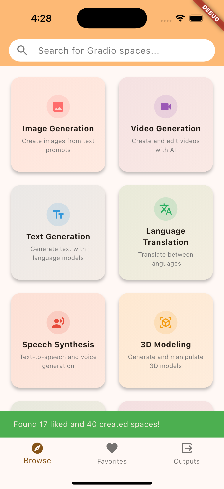
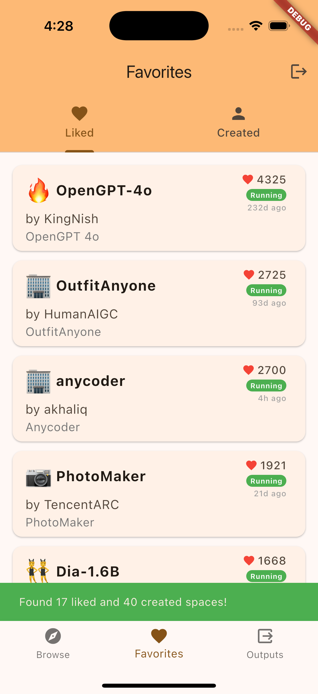
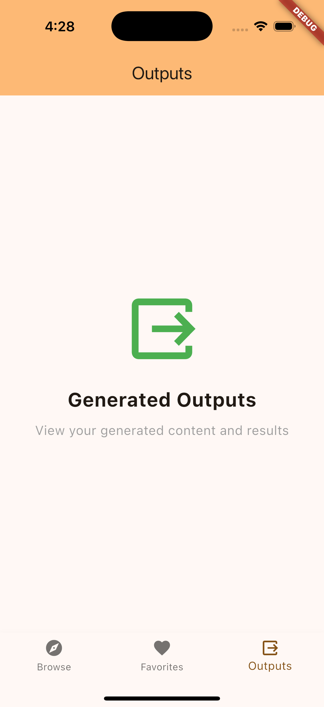

# Gradio Mobile App
[Available on iOS](https://apps.apple.com/us/app/gradio-spaces/id6753218161)

Available on Android Soon!

A Flutter mobile application for browsing and managing Gradio spaces from HuggingFace. Features OAuth authentication, automatic username detection, and categorized space browsing.

## Features

- 🔐 **OAuth Authentication** - Secure login with HuggingFace
- 👤 **Automatic Username Detection** - No manual username entry required
- 📱 **Space Categories** - Browse by Image Generation, Text Generation, etc.
- ❤️ **Liked Spaces** - View your public liked Gradio spaces
- 👨‍💻 **Created Spaces** - See your own Gradio spaces
- 🔄 **Pull-to-Refresh** - Keep your spaces up to date

## Prerequisites
Follow [these](https://docs.flutter.dev/get-started/install/macos/mobile-ios) instructions for setting up Flutter on iOS.
Follow [these](https://docs.flutter.dev/get-started/install/macos/mobile-android) instructions for setting up Flutter on Android.

Before running this app, ensure you have:

### 1. Flutter Development Environment
- **Flutter SDK** (3.9.0 or higher)
- **Dart SDK** (included with Flutter)
- **Xcode** (for iOS development on macOS)
- **Android Studio** (for Android development)

### 2. Platform-Specific Setup

#### iOS (macOS only)
```bash
# Install Xcode from Mac App Store
# Install Xcode command line tools
sudo xcode-select --install

# Install CocoaPods
sudo gem install cocoapods
```

#### Android
```bash
# Install Android Studio
# Configure Android SDK and create virtual device
# Accept Android licenses
flutter doctor --android-licenses
```

## Quick Test (Prebuilt iOS App)

If you want to test the app immediately without setting up Flutter, you can use the prebuilt iOS app.

### iOS Simulator (macOS only)
1. Download [Runner-iOS-Simulator.zip](./Runner-iOS-Simulator.zip)
2. Unzip the file to extract `Runner.app`
3. Open iOS Simulator:
   ```bash
   open -a Simulator
   ```
4. Wait for the simulator to load, then drag `Runner.app` onto the simulator screen
5. The app will install automatically and appear on the home screen
6. Tap the app icon to launch it

**Requirements**: macOS with Xcode and iOS Simulator installed.

**Note**: The prebuilt app is configured for iOS Simulator only and won't work on physical devices.

---

## Running the App (Development)
### Setup Instructions

### 1. Clone and Install Dependencies

```bash
# Clone the repository
git clone <repository-url>
cd gradio-mobile-app

# Install Flutter dependencies
flutter pub get

# For iOS: Install CocoaPods dependencies
cd ios
pod install
cd ..
```

### 2. Verify Setup

```bash
# Check Flutter installation and connected devices
flutter doctor
```

### Option 1: Using Flutter CLI

```bash
# List available devices
flutter devices

# Run on iOS Simulator
flutter run -d "iPhone 16 Pro"

# Run on Android Emulator
flutter run -d "Pixel_8_API_34"

# Run in debug mode (default)
flutter run --debug

# Run in release mode (optimized)
flutter run --release
```

### Option 2: Using VS Code

1. Open the project in VS Code
2. Install the Flutter extension
3. Press `F5` or use the "Run and Debug" panel
4. Select your target device

### Option 3: Using Android Studio/IntelliJ

1. Open the project in Android Studio
2. Select your target device from the device dropdown
3. Click the "Run" button (green play icon)

### Option 4: Using Xcode (iOS only)

1. Open `ios/Runner.xcworkspace` in Xcode
2. Select your target device/simulator
3. Press `Cmd + R` to run

## Screenshots

<div align="center">





</div>
